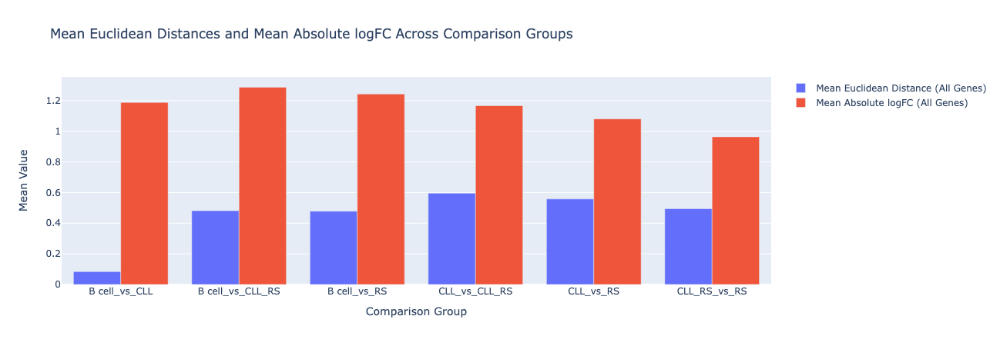
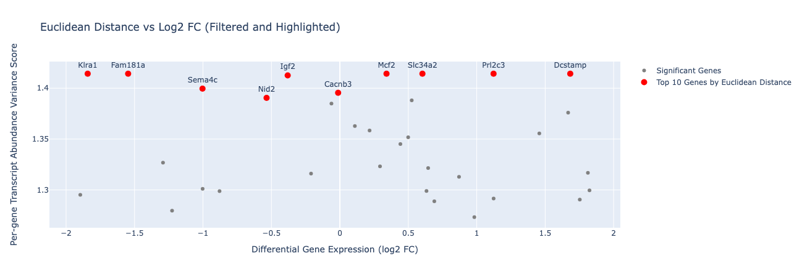

# Comparative Transcriptomic Analysis of Chronic Lymphocytic Leukemia and Richter's Syndrome in a Murine Model

**Waqaas Akmal Butt**

## Introduction

Richter's syndrome (RS) represents the transformation of chronic lymphocytic leukemia (CLL) into an aggressive form of lymphoma, often associated with poor clinical outcomes. Understanding the molecular mechanisms underlying this transformation is critical for identifying therapeutic targets and improving patient prognosis. Previous studies have utilized various models to explore the transcriptional changes accompanying this transition. In this study, I performed a comparative analysis using a publicly available murine RNA-seq dataset to evaluate gene expression differences between normal B cells, CLL, and RS. I aimed to contrast against the findings of a recent study you performed (PMID: 36468984) that identified distinct gene expression profiles and pathway alterations in these conditions and to provide additional insights using transcript abundance variance metrics.

## Methods

### Data Acquisition and Preprocessing

I obtained the murine RNA-seq dataset from the Gene Expression Omnibus (GEO) repository (Accession: GSE186137), which included transcriptomic data from flow-sorted B cells isolated from four different groups of mice: normal B cells (n = 4), CLL (n = 5), CLL transitioning to RS (CLL_RS, n = 4), and RS (n = 11). The dataset was processed to generate Transcripts Per Million (TPM) normalized counts for each sample using Salmon.

### Sample Grouping and Analysis Pipeline

Samples were grouped according to their 'source_name': 'RS', 'B cell', 'CLL', and 'CLL_RS'. For each sample group, TPM data was subsetted to create distinct data frames for subsequent analysis. I performed an ANOVA at the transcript level to identify differentially expressed genes across all four groups. An FDR correction was applied to account for multiple testing, and transcripts with an adjusted p-value below 0.1 were considered significant. Gene-level aggregation was performed by selecting the transcript with the minimum adjusted p-value for each gene, allowing for a gene-centric view of differential expression.

### Transcript Abundance Variance as a Function of L2 Normalization and Euclidean Distance Across TPM Counts

To analyze gene expression differences between normal B cells, CLL, CLL transitioning to RS (CLL_RS), and RS, I first transformed transcript-level TPM counts into gene-level transcript abundance scores. This process involved aggregating TPM values for all transcripts associated with a given gene.

For each gene, I identified all corresponding transcript IDs from the dataset and computed the sum of their TPM values within each sample group (B cell, CLL, CLL_RS, RS). This summed value represents the total transcript abundance for that gene in a particular sample. Next, I calculated the mean transcript abundance across all samples within each group to derive a representative expression level for each gene.

To assess variance in gene expression across different conditions, I performed L2 normalization on the summed TPM values for each gene. L2 normalization was achieved by dividing each transcript TPM value by the gene’s Euclidean norm (the square root of the sum of squares of all TPM values for that gene across samples). This normalization step ensures that gene expression levels are scaled appropriately, facilitating direct comparison between groups.

Following normalization, I computed Euclidean distances between each pair of sample groups (B cell vs. CLL, B cell vs. CLL_RS, B cell vs. RS, CLL vs. CLL_RS, CLL vs. RS, and CLL_RS vs. RS) to quantify transcriptional differences. Euclidean distance, a measure of dissimilarity, was calculated as the square root of the sum of squared differences between the normalized expression vectors of each group. This metric provided a quantitative measure of transcript abundance variance for each gene across different stages of disease transformation.

### Visualization and Interpretation

Two primary visualizations were generated to interpret the results:

1. **Bar Graph of Mean Euclidean Distances and Mean Absolute Log2 Fold Changes:** This plot displays the average Euclidean distances and mean absolute log2 fold changes across different comparison groups ('B cell_vs_CLL', 'B cell_vs_CLL_RS', 'B cell_vs_RS', 'CLL_vs_CLL_RS', 'CLL_vs_RS', 'CLL_RS_vs_RS'). This approach highlights the overall transcriptomic differences between the groups at the gene level.

2. **Scatter Plot of Euclidean Distance vs. Log2 Fold Change:** This plot identifies top genes by Euclidean distance (above the 95th percentile of Euclidean distance) that have a log2 fold change less than 2, which is the exclusion threshold used in the original study for the dataset. This provides a more zoomed-in view of contributing genes that the original study may not have identified due to insufficient differential gene expression. For each gene, the highest Euclidean distance across all six comparison groups is plotted. In the interactive version of the plot, hovering over each point reveals which comparison group generated the Euclidean distance. The top ten genes by Euclidean distance have been highlighted and annotated.

## Results

My analysis identified significant transcriptional changes associated with the progression from normal B cells to RS, but not as much for the progression from normal B cells to CLL. This finding suggests that most transcript-level dysregulation occurs at the threshold between CLL and RS, which might be a key factor in the transformation of CLL into more aggressive types of cancer.

The scatter plot further highlighted specific genes that showed the most pronounced differences in expression between the groups, including **Klr1, Fam181a, Sema4c, MCF2,** and **Dcstamp**. These genes may represent novel markers or drivers of disease transformation that warrant further investigation.

## Discussion

The results of my analysis are consistent with those reported in the original study, which identified distinct expression profiles between RS and CLL, characterized by upregulation of pathways involved in cell survival and proliferation (e.g., E2F/MYC targets, G2–M checkpoint) and downregulation of immune response genes (e.g., IFNγ response, IL6/JAK/STAT3, IL2/STAT5 signaling). My approach using Euclidean distance and log2 fold change metrics added to these findings, allowing for the identification of specific genes that contribute to the variance between conditions without showing significant differential gene expression.

While my analysis successfully replicated some findings from the original study, certain limitations should be noted. I did not perform pathway enrichment analysis or assess specific signaling pathways like E2F/MYC or IL6/JAK/STAT3, which were highlighted in the original study as key players in RS transformation. Additionally, my analysis did not include immune response pathway evaluation or transcriptional reprogramming metrics, which could provide further insights into the molecular mechanisms underlying the progression from CLL to RS.

## Conclusion

My study confirms the distinct gene expression changes associated with the transformation of CLL to RS in a murine model and identifies additional genes that may play critical roles in this process. Future studies should aim to expand on these findings by incorporating pathway analysis and immune response profiling to gain a more comprehensive understanding of the molecular drivers of RS.
